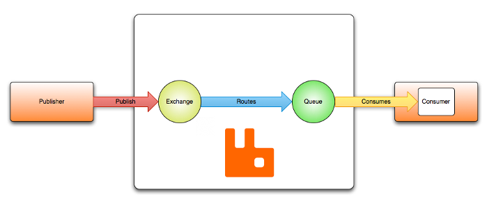
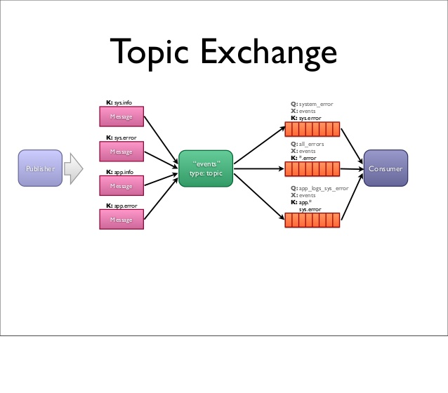
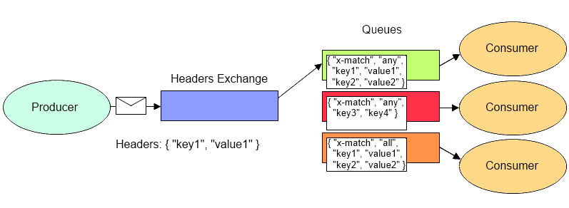

# rabbitmq
The main goal of this project is to explore basic features of Spring AMQP.

_Reference_: https://blogs.vmware.com/vfabric/2013/02/choosing-your-messaging-protocol-amqp-mqtt-or-stomp.html  
_Reference_: https://www.rabbitmq.com/tutorials/amqp-concepts.html

# preface
**RabbitMQ** is an open source message broker software that supports:
* Advanced Message Queuing Protocol (AMQP),
* Streaming Text Oriented Messaging Protocol (STOMP), 
* Message Queuing Telemetry Transport (MQTT).

## AMQP
Two of the most important reasons to use AMQP are reliability and interoperability.
As the name implies, it provides a wide range of features related to:
* messaging, 
* reliable queuing, 
* topic-based publish-and-subscribe messaging, 
* flexible routing, 
* transactions, 
* security. 

AMQP exchanges route messages directly—in fanout form, by topic, and also based on headers.

## STOMP
STOMP (Simple/Streaming Text Oriented Messaging Protocol) is the only one of these three protocols to be text-based, 
making it more analogous to HTTP in terms of how it looks under the covers. Like AMQP, STOMP provides a message 
(or frame) header with properties, and a frame body.

STOMP does not, however, deal in queues and topics—it uses a SEND semantic with a "destination" string. 
The broker must map onto something that it understands internally such as a topic, queue, or exchange. 
Consumers then SUBSCRIBE to those destinations.

## MQTT
The design principles and aims of MQTT are much more simple and focused than those of AMQP — 
it provides publish-and-subscribe messaging (no queues, in spite of the name) and was specifically 
designed for resource-constrained devices and low bandwidth, high latency networks.

It offers three qualities of service: 
* fire-and-forget / unreliable,
* "at least once" to ensure it is sent a minimum of one time (but might be sent more than one time),
* "exactly once".

MQTT’s strengths are:
* simplicity (just five API methods), 
* compact binary packet payload (no message properties, compressed headers, much less verbose than 
something text-based like HTTP),
* good fit for simple push messaging scenarios such as temperature updates, stock price tickers, oil pressure feeds 
or mobile notifications.

# RabbitMQ AMQP
## overview

## exchange
Exchanges are AMQP entities where messages are sent. Exchanges take a message and route it into zero or more queues. 
The routing algorithm used depends on the exchange type and rules called bindings.

Besides the exchange type, exchanges are declared with a number of attributes, the most important of which are:
* Name
* Durability (exchanges survive broker restart)
* Auto-delete (exchange is deleted when last queue is unbound from it)

### direct
A direct exchange delivers messages to queues based on the message routing key:
1. A queue binds to the exchange with a routing key K
1. When a new message with routing key R arrives at the direct exchange, 
the exchange routes it to the queue if K = R

### topic
Topic exchanges route messages to one or many queues based on matching between a message routing key and the pattern 
that was used to bind a queue to an exchange.

Use cases: 
* News updates that involve categorization or tagging (for example, only for a particular sport or team).
* Distributing data relevant to specific geographic location, for example, points of sale.

### fanout
A fanout exchange routes messages to all of the queues that are bound to it and the routing key is ignored. 
If N queues are bound to a fanout exchange, when a new message is published to that exchange a copy of the 
message is delivered to all N queues.

Use cases: 
* Sport news sites can use fanout exchanges for distributing score updates to mobile clients in near real-time.
* Group chats can distribute messages between participants using a fanout exchange.

### header
A headers exchange is designed for routing on multiple attributes that are more easily expressed as message 
headers than a routing key. Headers exchanges ignore the routing key attribute. Instead, the attributes used 
for routing are taken from the headers attribute. A message is considered matching if the value of the header 
equals the value specified upon binding.

It is possible to bind a queue to a headers exchange using more than one header for matching. This is what the 
"x-match" binding argument is for. When the "x-match" argument is set to "any", just one matching header value 
is sufficient. Alternatively, setting "x-match" to "all" mandates that all the values must match.

Headers exchanges can be looked upon as "direct exchanges on steroids". Because they route based on header values, 
they can be used as direct exchanges where the routing key does not have to be a string; it could be an integer 
or a hash (dictionary) for example.

## queue
They store messages that are consumed by applications.

Properties:
* Name
* Durable (the queue will survive a broker restart)
* Exclusive (used by only one connection and the queue will be deleted when that connection closes)
* Auto-delete (queue that has had at least one consumer is deleted when last consumer unsubscribes)
* Arguments (optional; used by plugins and broker-specific features such as message TTL, queue length limit, etc)

## bindings
Bindings are rules that exchanges use (among other things) to route messages to queues. To instruct an exchange 
E to route messages to a queue Q, Q has to be bound to E. Bindings may have an optional routing key attribute 
used by some exchange types.

To draw an analogy:
* Queue is like your destination in New York city
* Exchange is like JFK airport
* Bindings are routes from JFK to your destination. There can be zero or many ways to reach it

## delivery
If AMQP message cannot be routed to any queue (for example, because there are no bindings for the exchange it was 
published to) it is either dropped or returned to the publisher, depending on message attributes the publisher has set.

http://localhost:15672/#/

http://localhost:8080/customers

http://localhost:8090/customers